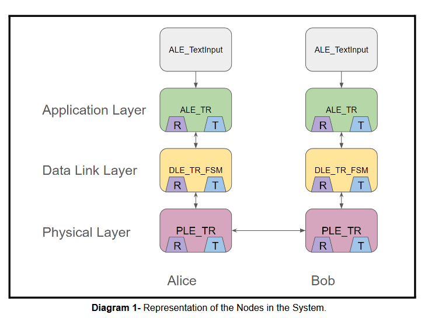
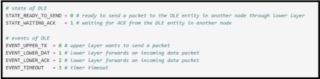
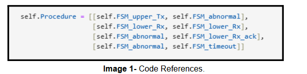
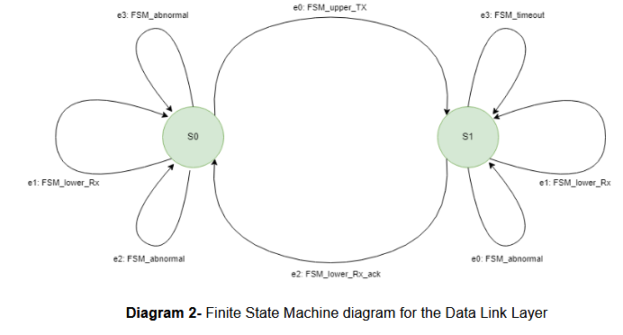

# General Idea of Code
The code for the Stop and Wait protocol works as follows:

The user can insert a text input through the interface created to by ALE_TextInput.

The application layer of the transmitting node will take this input and will send it
to the lower Data Link Layer.

The Data Link Layer will send the data to the lower physical layer, and will then
stop and wait for a frame acknowledgement. At this moment a timer is activated to allow for
different situations and transitions.

If the timer expires then it can be concluded that the acknowledgement was not received and the data is considered lost and we prepare for retransmission of the packet. If the
data did not make it then the chance of receiving the data is either 10% or percentage of
transmission loss. This simulates a different transmission layer. If the data does make it to the
endpoint, then there is a chance that the acknowledgement was the part that was lost, so this
retransmission will be considered a duplicate which has a 5% of occurring.

The Physical Layer then sends the data to the receiving node’s physical layer.
This data is then sent up to the upper Data Link Layer.

The Receiver Data Link Layer sends this data to the upper Application Level
through the Queue_Rx. In this moment an acknowledgement is sent to the lower physical layer
which is then sent to the transmitter’s node Data Link Layer.

Lastly, the text message is received and is printed by the receiving node.

The code keeps track of all this through the use of these keywords: Rx and Tx are
Receiver and Transmitter, upper and lower indicate the direction through the layers (Look at
diagram) When transmitting we go to the lower layers of our node and then go through the
upper layers of the receiver.

When a duplex scenario is involved and a more complex protocol is desired, there
comes a need to employ a Finite State Machine for the Data Link Layer. This Finite State
Machine will allow us to keep track of the many possible events, states and actions in our
system.

In the case of our code, we have a duplex stop and wait protocol with the following:

## States:
* S0: Ready to send a packet.
* S1: Waiting for acknowledgement.
## Events
* e0: Upper Layer wants to send a Packet.
* e1: Lower Layer forwards an incoming data packet.
* e2: Lower layer sends an acknowledgement.
* e3: timer timeout.
## Actions
* FSM_lower_Rx: Send the received packet to an upper layer then wait for
an acknowledgment.
* FSM_lower_Rx_ack: Confirm the Acknowledgement, then the layer is
open to send new data.
* FSM_upper_Tx: Send the received packet to a lower layer then wait for
an acknowledgement.
* FSM_abnormal: Incorrect event and state, an error is printed out.
* FSM_timeout: Retransmit the packet that has been received

